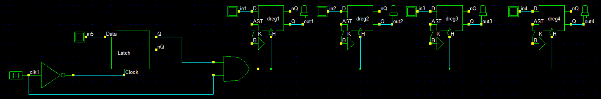
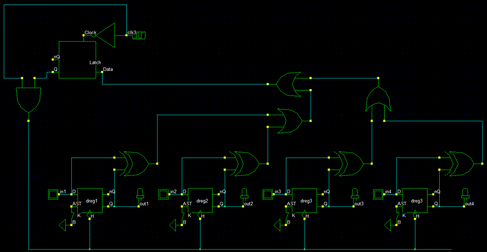
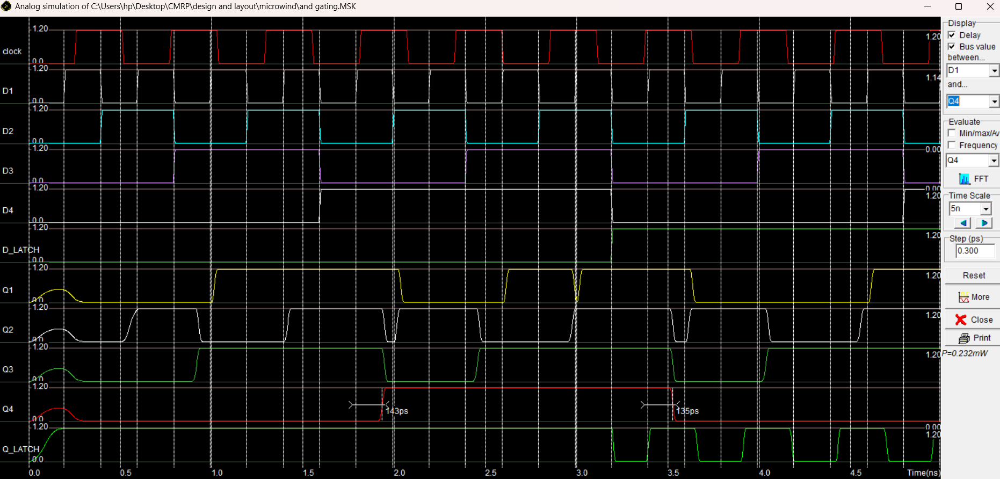
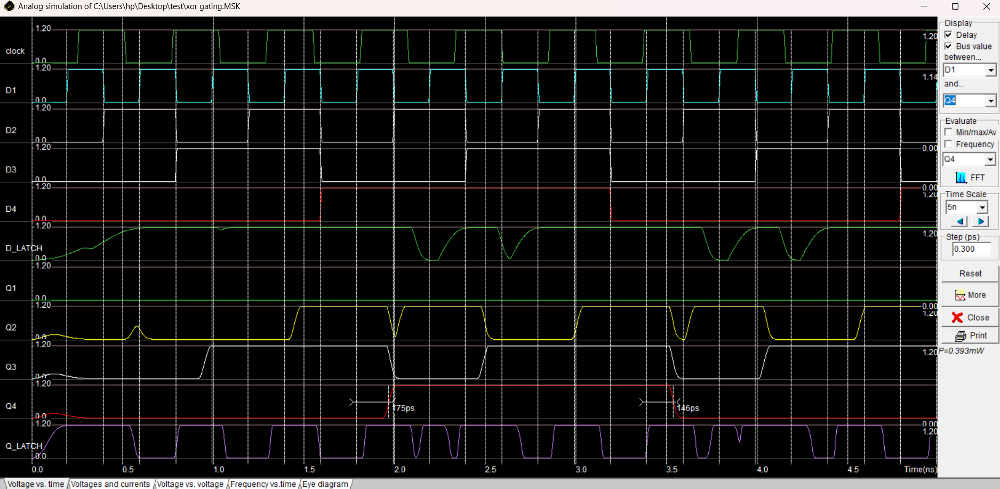

<div align="center">

# ⚡ clock-gated-cmos-4bit-register

**AND-Based vs XOR-Based Shared Clock Gating on a 4-Bit PIPO CMOS Register**

*Transistor-level design → shared ICG cell → power, delay & area comparison at 0.12 µm CMOS*

[](http://www.microwind.net/)
[](http://www.microwind.net/)
[]()
[]()
[](https://iiitn.ac.in/)

</div>

---

## 📖 Overview

This project designs and compares two **shared clock gating** strategies for a **4-bit Parallel-In Parallel-Out (PIPO) register** built from edge-triggered CMOS D flip-flops. The clock network can consume up to 40–60% of total dynamic power in synchronous systems — clock gating selectively disables the clock when registers are idle, cutting this waste without changing logical behaviour.

Two Integrated Clock Gating (ICG) architectures are implemented and evaluated head-to-head:

| Technique | Enable Logic | When Clock Activates |
|:---|:---|:---|
| **AND-based** | External enable signal `EN` | Whenever `EN = 1` |
| **XOR-based** | `ENi = Di ⊕ Qi` OR-reduced across all bits | Only when any input data changes |

Both use the same latch-and-AND ICG cell structure to guarantee **glitch-free** operation.

> 📄 Full research paper available in [`docs/`](docs/)

---

## 🏆 Results at a Glance

| Parameter | AND-Based | XOR-Based |
|:---|:---:|:---:|
| Technology Node | 0.12 µm CMOS | 0.12 µm CMOS |
| Supply Voltage (V) | 1.2 | 1.2 |
| Power Dissipation (mW) | **0.232** | 0.393 |
| Propagation Delay (ps) | **135–143** | 146–175 |
| Mean Rise Delay (ns) | 0.407 | **0.099** |
| Power Efficiency avg (%) | 0.399 | 0.095 |
| **Power-Delay Product (%·ns)** | 0.0683 | **0.0390** |
| Layout Area (µm²) | **≈ 2,060** | ≈ 4,940 |
| Optimum Load Range (fF) | 70–75 | 40–70 |

> **AND-based** wins on area and raw power. **XOR-based** wins on power-delay product and idle-period efficiency — better for event-driven, data-sparse workloads.

---

## 📁 Repository Structure

```
clock-gated-cmos-4bit-register/
├── docs/
│   ├── clock_gated_cmos_register_AND_vs_XOR.pdf     # Full research paper
│   └── parametric_analysis/
│       ├── AND_GATING_parametric.docx
│       └── XOR_GATING_parametric.docx
├── design/
│   ├── dsch/
│   │   ├── and_gating.sch                            # DSCH schematic — AND gating
│   │   └── xor_gating.sch                            # DSCH schematic — XOR gating
│   └── microwind/
│       ├── and_gating.MSK                            # Microwind layout — AND gating
│       ├── xor_gating.MSK                            # Microwind layout — XOR gating
│       └── base.MSK                                  # Base D flip-flop cell
├── img/
│   ├── dsch/
│   │   ├── and_gating_schematic.png
│   │   ├── and_gating_timing_.png
│   │   ├── xor_gating_schematic.png
│   │   ├── xor_gating_timing.png
│   └── microwind/
│       ├── and_gating_layout.png
│       ├── and_gating_layout_area.png
│       ├── and_gating_simulation.png
│       ├── xor_gating_simulation.png
│       └── performance/
│           ├── and_power_efficiency.png
│           ├── and_rise_delay.png
│           ├── xor_power_efficiency.png
│           └── xor_rise_delay.png
├── .gitignore
└── README.md
```

---

## 🧮 Theory

### Dynamic Power Model

$$P_{dyn} = \alpha \cdot C_L \cdot V_{DD}^2 \cdot f$$

where **α** is the activity factor. In an ungated register, the clock toggles every cycle → α ≈ 1. Clock gating reduces α proportional to how often the register actually needs updating.

### AND-Based Gating

```
         ┌──────┐  ENL    ┌─────┐
  EN ───▶│Latch │────────▶│ AND │──▶ CLKg ──▶ FF1..FF4
 CLK̄ ───▶│      │  CLK ──▶│     │
         └──────┘          └─────┘
```

`EN` is latched on the falling clock edge — ensuring it can only change while CLK is low — then ANDed with the clock. Simple, compact, deterministic.

### XOR-Based Gating

```
  D0,Q0 ──▶ XOR ──┐
  D1,Q1 ──▶ XOR ──┤ OR ──┐
  D2,Q2 ──▶ XOR ──┤ OR ──┤ OR ──▶ EN_SHARED ──▶ Latch ──▶ AND ──▶ CLKg
  D3,Q3 ──▶ XOR ──┘       └─────────────────────────────────────────────
```

Each bit's pending change is detected via `ENi = Di ⊕ Qi`. The four signals are OR-reduced to form a shared enable — the clock only fires when *any* bit needs to update.

### XOR Enable Probability (4-bit, Pt = 0.25)

$$P_{EN,shared} = 1 - (1 - P_t)^N = 1 - (0.75)^4 \approx 68.4\%$$

This yields a theoretical **~31.6% reduction** in dynamic clock power compared to always-on clocking.

---

## 🔧 Gating Circuit Components

### AND-Based ICG Cell

| Block | Implementation |
|:---|:---|
| Enable Latch | Two NAND gates + inverter (level-sensitive, samples EN when CLK is low) |
| AND Gate | Standard 2-input CMOS (full voltage swing, low leakage) |

**Gating delay:** `tg = tpd(latch) + tpd(AND)`

### XOR-Based ICG Cell

| Block | Count | Purpose |
|:---|:---:|:---|
| XOR gates | 4 | Bit-level data transition detection |
| OR gates | 3 | Hierarchical enable reduction |
| Level-sensitive latch | 1 | Glitch-free enable hold |
| AND gate | 1 | Final clock gating |

---

## 🖼️ Key Plots

<table>
<tr>
<td align="center"><br><sub>DSCH — AND-based schematic</sub></td>
<td align="center"><br><sub>DSCH — XOR-based schematic</sub></td>
</tr>
<tr>
<td align="center"><br><sub>Microwind — AND gating waveform</sub></td>
<td align="center"><br><sub>Microwind — XOR gating waveform</sub></td>
</tr>
</table>

---

## 🚀 Getting Started

### Requirements

- [Microwind 3.1](http://www.microwind.net/) — transistor-level layout and analog simulation
- [DSCH 3.5 Lite](http://www.microwind.net/) — logic-level schematic and timing simulation

Both tools are free to download at [microwind.net](http://www.microwind.net/).

### Open the Designs

```
# Logic-level simulation (DSCH)
Open design/dsch/and_gating.sch    → run simulation → observe timing waveform
Open design/dsch/xor_gating.sch    → run simulation → observe timing waveform

# Transistor-level layout (Microwind)
Open design/microwind/and_gating.MSK  → Simulate → Analog Waveform
Open design/microwind/xor_gating.MSK  → Simulate → Analog Waveform
```

### Parametric Sweep (Microwind)

`Simulate → Parametric Analysis → Capacitance` — sweep 0 fF to 100 fF to reproduce the delay, power efficiency, and PDP curves in [`docs/parametric_analysis/`](docs/parametric_analysis/).

---

## 🏭 Applications

- **Microprocessor & DSP Pipelines** — reduce redundant clock transitions in register stages during instruction decode and execution
- **Memory & Register File Units** — shared gated clock improves energy efficiency in idle SRAM banks
- **IoT Edge Devices** — XOR-based gating ideal for low-duty-cycle nodes where data transitions are sparse
- **Battery-Powered Embedded Systems** — extends operational lifetime by suppressing switching during standby or sleep states

---

## 🔭 Future Work

- Multi-level hierarchical clock gating combining register-level and block-level control
- Pulse-triggered latch-based gating to further reduce glitch power
- Migration to sub-65 nm FinFET / FDSOI technology nodes for accurate leakage modelling
- HDL-based automatic clock gating insertion via synthesis tools for large-scale integration

---

## 📚 References

[1] Y.-T. Hwang and J.-F. Lin, "Low-Power Pulse-Triggered Flip-Flop Design With Conditional Pulse-Enhancement Scheme," IEEE Transactions on Very Large Scale Integration (VLSI) Systems, vol. 20, no. 2, pp. 361–366, Feb. 2012. 🔗 https://ieeexplore.ieee.org/document/5682078 

[2] M. Alioto, "Ultra-Low Power VLSI Circuit Design Demystified and Explained: A Tutorial," IEEE Transactions on Circuits and Systems I: Regular Papers, vol. 59, no. 1, pp. 3–29, Jan. 2012. 🔗 https://ieeexplore.ieee.org/document/6069267

[3] Q. Wu, M. Pedram, and X. Wu, "Clock-Gating and Its Application to Low Power Design of Sequential Circuits," IEEE Transactions on Circuits and Systems I: Fundamental Theory and Applications, vol. 47, no. 3, pp. 415–420, Mar. 2000. 🔗 https://ieeexplore.ieee.org/document/841927

[4] K. Min, H.-D. Choi, H.-Y. Choi, H. Kawaguchi, and T. Sakurai, "Leakage-Suppressed Clock-Gating Circuit With Zigzag Super Cut-Off CMOS (ZSCCMOS) for Leakage-Dominant Sub-70-nm and Sub-1-V-VDD LSIs," IEEE Transactions on Very Large Scale Integration (VLSI) Systems, vol. 14, no. 4, pp. 429–435, Apr. 2006. 🔗 https://ieeexplore.ieee.org/document/1621126

[5] H. Mahmoodi, V. Tirumalashetty, M. Cooke, and K. Roy, "Ultra Low-Power Clocking Scheme Using Energy Recovery and Clock Gating," IEEE Transactions on Very Large Scale Integration (VLSI) Systems, vol. 17, no. 1, pp. 33–44, Jan. 2009. 🔗 https://ieeexplore.ieee.org/document/4703179

[6] N. Srinivasan, N. S. Prakash, D. Shalakha, D. Sivaranjani, G. S. Sri Lakshmi, and B. B. T. Sundari, "Power Reduction by Clock Gating Technique," Procedia Technology, vol. 21, pp. 631–635, 2015. 🔗 https://www.sciencedirect.com/science/article/pii/S2212017315003606

[7] A. P. Chandrakasan and R. W. Brodersen, "Minimizing Power Consumption in Digital CMOS Circuits," Proceedings of the IEEE, vol. 83, no. 4, pp. 498–523, Apr. 1995. 🔗 https://ieeexplore.ieee.org/document/371964

[8] P. Bhattacharjee, A. Majumder, and T. D. Das, "A 90 nm Leakage Control Transistor Based Clock Gating for Low Power Flip Flop Applications," in Proc. 59th IEEE Int. Midwest Symp. Circuits and Systems (MWSCAS), Abu Dhabi, UAE, 2016, pp. 381–384. 🔗 https://ieeexplore.ieee.org/document/7870034

[9] Y.-T. Hwang, J.-F. Lin, and M.-H. Sheu, "Low-Power Pulse-Triggered Flip-Flop Design Based on a Signal Feed-Through Scheme," IEEE Transactions on Very Large Scale Integration (VLSI) Systems, vol. 22, no. 1, pp. 181–185, Jan. 2014. 🔗 https://ieeexplore.ieee.org/document/6414666

[10] J. Shinde and S. S. Salankar, "Clock Gating — A Power Optimizing Technique for VLSI Circuits," in Proc. Annual IEEE India Conference (INDICON), Hyderabad, India, 2011, pp. 1–4. 🔗 https://ieeexplore.ieee.org/document/6139440


---

## 👨‍💻 Author

**Pratham Kumar Uikey**  
ECE Department, Indian Institute of Information Technology Nagpur  
Butibori 441100, India

---

<div align="center">

MIT License · IIIT Nagpur · ECE Dept.

</div>